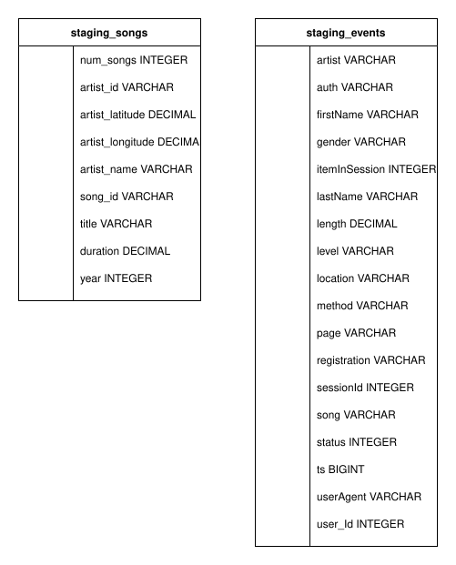
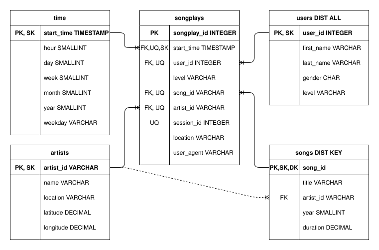

# Data Warehouse on AWS with S3 and Redshift

## Summary
* [Background](#Background)
* [Description](#Description)
* [Dataset](#Dataset)
* [Schema](#Schema)
* [ETL process](#ETL-process)
* [How to run](#How-to-run)
* [Project structure](#Project-structure)
--------------------------------------------

#### Background

This project is part of the Udacity Data Engineering Nanodegree. For this project the fictional company Sparkify has grown past the initial databases created in the PostgreSQL-Data-Modeling Project and now the company needs a more robust database to store the ever increasing data. The goal of this project is to create a database inside of AWS Redshift and populate it from log files stored in a S3 Bucket. This project also introduces the concept of Infrastructure as Code (IaC). Part of the project entails creating a python script to launch a new AWS Redshift cluster.

--------------------------------------------

#### Description

In this project we use two Amazon Web Services: Simple Storage Service aka [S3](https://aws.amazon.com/s3/) (Data storage) and [Redshift](https://aws.amazon.com/redshift/) (Data warehouse with ``columnar storage``)

This project builds on lessions from the previous two Udacity projects on data modeling. As such, the data warehouse queries in Postgres SQL is reused with some modification for Redshift-specific optimization hints. We use the IaC method using the AWS python SDK to manage our AWS resources: S3 access and Redshift cluster.

The Redshift service is where data is ingested and transformed though the COPY command, which accesses to the JSON files inside the buckets and copies their content to our target staging tables.

--------------------------------------------

#### Dataset

There are two datasets for this project. The Song data and the log data. Both of these datasets are stored in s3 buckets provided by Udacity.

##### Song Dataset

Each song in the song dataset is stored as a separate JSON file. These JSON files are stored in an s3 partition based on the first three letters of each song’s track ID. Below is an example provided by Udacity:

> song_data/A/B/C/TRABCEI128F424C983.json  
> song_data/A/A/B/TRAABJL12903CDCF1A.json

An example of the JSON format for each song is:

<code>{“num_songs”: 1, “artist_id”: “ARJIE2Y1187B994AB7”, “artist_latitude”: null, “artist_longitude”: null, “artist_location”: “”, “artist_name”: “Line Renaud”, “song_id”: “SOUPIRU12A6D4FA1E1”, “title”: “Der Kleine Dompfaff”, “duration”: 152.92036, “year”: 0}</code>

##### Log Dataset

The logfiles for each day are stored in a JSON file. These JSON files are partitioned in s3 by year and month. An example of this formation is:

> log_data/2018/11/2018-11-12-events.json  
> log_data/2018/11/2018-11-13-events.json

Each JSON file is actually a JSON line formatted. In a JSON line file each line is a valid JSON object; however, this means the actual file itself cannot be treated as a JSON file. To avoid errors while reading this file into Python it is recommend to use pandas with the following format:

A sample of this log data in a dataframe is shown below: 

--------------------------------------------

#### Schema

This is the schema of the database

How to read the schema:
* PK is Primary Key.
* FK are Foreign Keys.
* SK is Sort Key.
* DK is Distribution Key.
* UQ are Uniquie Keys. These are additional constraints on fields other than Primary Keys to enforce uniqueness.
* Solid lines indicate references between Primary and Foreign Keys that model the [Star schema](https://wikipedia.org/wiki/Star_schema).
* Dotted lines indicate references between Primary and Foreign Keys that model the [Snowflake schema](https://wikipedia.org/wiki/Snowflake_schema).

There are two staging tables: one for song dataset and one for event dataset.

To represent this context a ``Star schema`` has been used

The songplays table is the core of this schema, is it our fact table and it contains foreign keys to four tables;
* start_time REFERENCES time(start_time)
* user_id REFERENCES time(start_time)
* song_id REFERENCES songs(song_id)
* artist_id REFERENCES artists(artist_id)

--------------------------------------------

#### ETL process

In this project Python is used to orchestrate the initialization and termination of S3 and Redshift instances on AWS. For most of ETL, these procedures are performed with SQL (Python is used as wrapper code). Specifically, the transformation and data normalization is done by Query. Check out the ``sql_queries`` python module.

--------------------------------------------

#### How to run

##### Method A: Jupyter Notebook
1. Open data_warehouse_with_aws.ipynb in a Jupyter Notebook session.
2. Go to ``Kernel > Restart & Run All`` or click on the ⏩️ button.

3. Enter your AWS access key ID when prompted for KEY.
4. Enter your AWS Secret access key when prompted for SECRET.
5. Press \<Enter> key to leave blank when prompted for HOST. Your Redshift endpoint address will later be retrieved by the Python script.
5. Press \<Enter> key to leave blank when prompted for ARN. Your IAM role ARN for S3 read-only will later be retrieved by the Python script.
5. Enter a password that will be used for the dwhuser in Redshift.

##### Method B: Python
1. Although the data-sources are provided by two [``S3 buckets``](https://aws.amazon.com/en/s3/) the only thing you need for running the example is an [``AWS Redshift Cluster``](https://aws.amazon.com/en/redshift/) up and running. You will need to pre-fill the ``dwh.cfg`` in sections KEY, SECRET, HOST, and ARN with existing values.
2. Run create_tables.py. This will run drop and create SQL statement in Redshift.
3. Run etl.py. This will copy the JSON data from S3 to the staging tables while parsing them. This will also copy the data from the staging tables to the dimension and fact tables using the star schema above.

<b> Notes: </b>
* In this example a Redshift ``dc2.large`` cluster with <b> 4 nodes</b> has been created, with a cost of ``USD 0.25/h (on-demand option)`` per cluster.
* In this example we will use [``IAM role``](https://docs.aws.amazon.com/en_us/IAM/latest/UserGuide/id_roles.html) authorization mechanism, the only policy attached to this IAM will be am [``AmazonS3ReadOnlyAccess``](https://aws.amazon.com/en/blogs/security/organize-your-permissions-by-using-separate-managed-policies/)

--------------------------------------------

#### Project structure
This is the project structure, if the bullet contains ``/`` means that the resource is a folder:

* <b> /img </b> - Simply a folder with images that are used in this ``md``
* <b> /img/erd_1.svg </b> - Table definitions of the staging tables.
* <b> /img/erd_2.svg </b> - Entity relationship diagram and table definitions of the fact and dimension tables.
* <b> create_tables.py </b> - This script will drop old tables (if exist) ad re-create new tables
* <b> data_warehouse_with_redshift.ipynb </b> - Jupyter Notebook containing additional python scipts that handle the initialization and termination of S3 and Redshift instances on AWS.
* <b> dhw.cfg </b> - Configuration file used that contains info about Redshift, IAM and S3
* <b> etl.py </b> - This script executes the queries that extract JSON data from the S3 bucket and ingest them to Redshift
* <b> sql_queries.py </b> - This file contains variables with SQL statement in String formats, partitioned by CREATE, DROP, COPY and INSERT statements

--------------------------------------------
